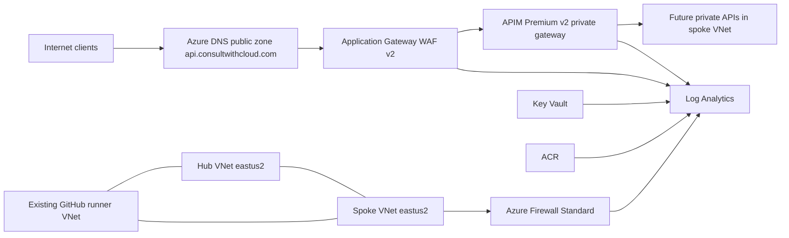

# Design Log #001: Hub-Spoke APIM Edge Platform

## Background

This repository is a documentation-first Azure APIM AI gateway lab. The current infrastructure is a safe Bicep skeleton and does not deploy live Azure resources. The next target state is a real deployable hub-spoke platform in Azure with APIM Premium v2, Application Gateway WAF, Azure Firewall, DNS, certificate management, diagnostics, ACR, Key Vault, and guarded GitHub Actions.

The implementation must follow `requirements/001-hub-spoke-apim-edge-platform.md`.

## Problem

The lab needs a secure but demonstrable public API edge. The repository is public, so workflow execution must be tightly controlled. The APIM gateway must be private, but the API hostname must be publicly reachable. The self-hosted runner exists in a separate VNet and must deploy and later validate hub and spoke resources. The design must be explicit enough for a future agent to implement without rediscovering every Azure constraint.

## Questions and Answers

Q: Which Azure region is the target?

A: `eastus2` for all newly deployed resources. `eastus` was rejected because current Microsoft documentation shows APIM Premium v2 support in East US 2, not East US.

Q: Are the hub and spoke in the same subscription?

A: Yes. Use subscription `c7a1d85d-159f-4cfc-bd13-51295c9acb96`.

Q: What address spaces are used?

A: Hub `10.10.0.0/16`, spoke `10.20.0.0/16`, and existing runner VNet `172.16.0.0/16`.

Q: What goes in the hub?

A: Hub VNet, Azure Firewall, Firewall Policy, firewall public IP, Log Analytics, ACR, Key Vault, public DNS child zone, Application Gateway WAF, APIM Premium v2, certificate-related identities, diagnostics, private APIM DNS, and hub-side peerings.

Q: What goes in the spoke?

A: Spoke VNet, workload subnet, private endpoint reserve subnet, AKS reserve subnet, route tables for spoke workload and future AKS egress, and spoke-side peerings.

Q: Why not deploy AKS now?

A: AKS introduces node pools, Kubernetes version, outbound type, workload identity, ACR pull, ingress, and upgrade policy decisions. This pass creates only `snet-aks`.

Q: Why APIM Premium v2?

A: It provides the private gateway VNet injection pattern selected for this platform. It also means the direct APIM management endpoint is not available, so management must use Azure portal, ARM, and GitHub Actions.

Q: How will public clients reach a private APIM gateway?

A: Public DNS resolves `api.consultwithcloud.com` to Application Gateway WAF. Application Gateway terminates public TLS, applies WAF, and opens HTTPS to APIM through the hub VNet.

Q: Is end-to-end TLS supported?

A: Yes. This is TLS on both legs: client to Application Gateway and Application Gateway to APIM. It is not TLS passthrough because WAF requires TLS termination.

Q: How is the Developer Portal reached?

A: Use the default APIM developer portal hostname and secure it manually with Microsoft Entra ID sign-in. Do not expose a custom developer portal hostname through Application Gateway in this pass because Premium v2 has custom domain limitations.

Q: How is APIM managed without VPN?

A: Through Azure portal and ARM-based deployment from GitHub Actions. Do not expose a direct APIM management endpoint.

Q: Should APIM outbound be forced through Azure Firewall?

A: No. Premium v2 VNet injection manages service dependency connectivity and should not be given a default route to firewall in this design. Spoke workload and future AKS subnets route outbound through Azure Firewall.

Q: Should Application Gateway subnet egress be forced through firewall?

A: No. Application Gateway v2 has routing constraints and should not receive a default route to a virtual appliance.

Q: Is DNS Private Resolver required?

A: No. Use Azure-provided DNS and private DNS zones where required. Do not deploy Azure DNS Private Resolver.

Q: Is Azure Firewall DNS proxy required?

A: No. Do not use Azure Firewall network rules with FQDN destinations. Prefer application rules for HTTPS FQDN filtering and IP or service-tag network rules where network rules are needed.

Q: Why direct peer runner to both hub and spoke?

A: VNet peering is not transitive. The runner must reach both hub resources and future spoke resources.

Q: Should Key Vault and ACR use private endpoints?

A: No for this pass. Restrict public network access using the runner NAT public IP and service-specific controls.

Q: How is the Let's Encrypt certificate created?

A: A separate guarded manual GitHub Actions workflow performs ACME DNS-01 validation in Azure DNS and imports the certificate into Key Vault.

Q: Are request and response bodies logged in APIM?

A: Yes, intentionally for the lab, with a README warning that prompts, completions, and sensitive content can be ingested into Log Analytics.

## Design

The deployment uses subscription-scope Bicep. `infra/bicep/main.bicep` creates the hub and spoke resource groups and then deploys resource-group-scoped modules into each group.

The hub VNet uses:

| Subnet | CIDR | Purpose |
|---|---|---|
| `AzureFirewallSubnet` | `10.10.0.0/26` | Azure Firewall |
| `snet-appgw` | `10.10.1.0/24` | Application Gateway WAF |
| `snet-apim` | `10.10.2.0/24` | APIM Premium v2 VNet injection |
| `snet-private-endpoints` | `10.10.3.0/24` | Reserved |

The spoke VNet uses:

| Subnet | CIDR | Purpose |
|---|---|---|
| `snet-workload` | `10.20.1.0/24` | Future workloads |
| `snet-private-endpoints` | `10.20.2.0/24` | Reserved |
| `snet-aks` | `10.20.10.0/23` | Future AKS |

The edge path is:

1. Public DNS child zone `api.consultwithcloud.com` has an apex alias `A` record to the Application Gateway public IP.
2. Application Gateway WAF v2 uses a Key Vault certificate for `api.consultwithcloud.com`.
3. Application Gateway backend HTTPS settings use host and SNI `api.consultwithcloud.com`.
4. APIM Premium v2 has the same gateway custom domain and certificate from Key Vault.
5. Private DNS maps the APIM gateway hostname to the APIM private IP for in-network resolution.

GitHub Actions uses two manual workflows:

- `infra-deploy.yml` with `mode` input `validate`, `what-if`, or `apply`.
- `certificate-issue.yml` for ACME DNS-01 issuance and Key Vault import.

Both workflows use:

- `workflow_dispatch` only.
- No `pull_request`.
- No `pull_request_target`.
- `permissions: contents: read, id-token: write`.
- `runs-on: [self-hosted, linux, x64, cwc-azure-deploy]`.
- Job `if` guards for actor, expected repository, and `refs/heads/main`.
- GitHub Environment approval before Azure-changing jobs.

## Implementation Plan

1. Update documentation first. Add this design log, add REQ-001, add the ExecPlan, and update indexes.
2. Refactor `infra/bicep/main.bicep` to subscription scope.
3. Add Bicep parameters and environment parameter files that avoid secrets in source control.
4. Add hub and spoke modules, using AVM modules where they fit and raw Bicep for peerings, route tables, diagnostics, and custom wiring.
5. Add Log Analytics, Firewall, Application Gateway, APIM, Key Vault, ACR, DNS, diagnostic settings, managed identities, and role assignments.
6. Add workflow guards and OIDC Azure login.
7. Add certificate workflow after the initial infra deployment can create DNS and Key Vault.
8. Update README files with warnings and runbook steps.
9. Validate with Bicep build, what-if, and workflow syntax checks.

## Examples

Good workflow trigger:

    on:
      workflow_dispatch:
        inputs:
          mode:
            type: choice
            options:
              - validate
              - what-if
              - apply

Bad workflow trigger:

    on:
      pull_request:
      pull_request_target:

Good token permissions:

    permissions:
      contents: read
      id-token: write

Good APIM management model:

    Manage APIM through Azure portal, ARM/Bicep, Azure CLI, and GitHub Actions.
    Do not publish a direct APIM management endpoint.

Bad APIM management model:

    Publish <apim-name>.management.azure-api.net through Application Gateway for public access.

## Trade-offs

Using APIM Premium v2 gives the desired private gateway model but forces the region to `eastus2` and removes the direct management endpoint pattern. That is acceptable because Azure portal and ARM are the intended management plane.

Using Application Gateway WAF gives public ingress and WAF inspection but means TLS is terminated and re-encrypted rather than passed through unchanged.

Using the existing North Europe runner VNet avoids creating another runner network now, but global peering adds latency and possible data transfer charges.

Avoiding private endpoints for Key Vault and ACR keeps the first deployment simpler and compatible with the existing runner NAT model, but it relies on public network firewall restrictions.

Starting WAF in Prevention mode increases security but may block legitimate traffic until WAF logs are reviewed and narrow exclusions are added.

Enabling APIM body logging improves demo observability but increases data sensitivity and ingestion cost.

## Verification Criteria

- `git diff --check` returns no whitespace errors.
- `az bicep build --file infra/bicep/main.bicep` succeeds after implementation.
- `az deployment sub what-if` shows only expected resources in hub and spoke resource groups.
- Workflows have no pull request triggers.
- Workflows include repository, actor, and branch guards.
- Application Gateway backend health for APIM is healthy after certificate binding.
- `https://api.consultwithcloud.com/status-0123456789abcdef` returns APIM service health through Application Gateway after DNS delegation and certificate binding.
- Log Analytics contains Azure Firewall resource-specific tables after test traffic.

## Sources

- [APIM v2 tiers overview](https://learn.microsoft.com/en-us/azure/api-management/v2-service-tiers-overview)
- [APIM v2 tier region availability](https://learn.microsoft.com/en-us/azure/api-management/api-management-region-availability)
- [Inject APIM Premium v2 in a private VNet](https://learn.microsoft.com/en-us/azure/api-management/inject-vnet-v2)
- [Configure APIM custom domains](https://learn.microsoft.com/en-us/azure/api-management/configure-custom-domain)
- [Application Gateway backend settings](https://learn.microsoft.com/en-us/azure/application-gateway/configuration-http-settings)
- [Application Gateway WAF overview](https://learn.microsoft.com/en-us/azure/web-application-firewall/ag/ag-overview)
- [Azure Firewall structured logs](https://learn.microsoft.com/en-us/azure/firewall/firewall-structured-logs)
- [Azure VNet peering overview](https://learn.microsoft.com/en-us/azure/virtual-network/virtual-network-peering-overview)
- [Azure Monitor diagnostic settings](https://learn.microsoft.com/en-us/azure/azure-monitor/essentials/diagnostic-settings)
- [Azure DNS alias records](https://learn.microsoft.com/en-us/azure/dns/dns-alias)
- [Key Vault soft delete overview](https://learn.microsoft.com/en-us/azure/key-vault/general/soft-delete-overview)
- [ACR authentication options](https://learn.microsoft.com/en-us/azure/container-registry/container-registry-authentication)
- [Deploy Bicep with GitHub Actions](https://learn.microsoft.com/en-us/azure/azure-resource-manager/bicep/deploy-github-actions)
- [GitHub OIDC reference](https://docs.github.com/en/actions/reference/security/oidc)

