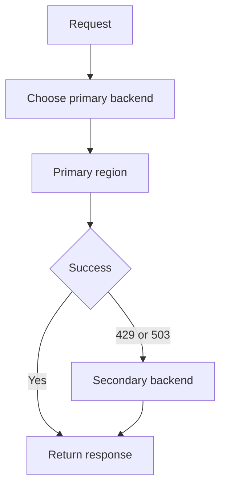

# Load Balancing Failover Flow

```mermaid
flowchart TD
  req[Request] --> choose[Choose primary backend]
  choose --> primary[Primary region]
  primary --> ok{Success}
  ok -->|Yes| response[Return response]
  ok -->|429 or 503| secondary[Secondary backend]
  secondary --> response
```
