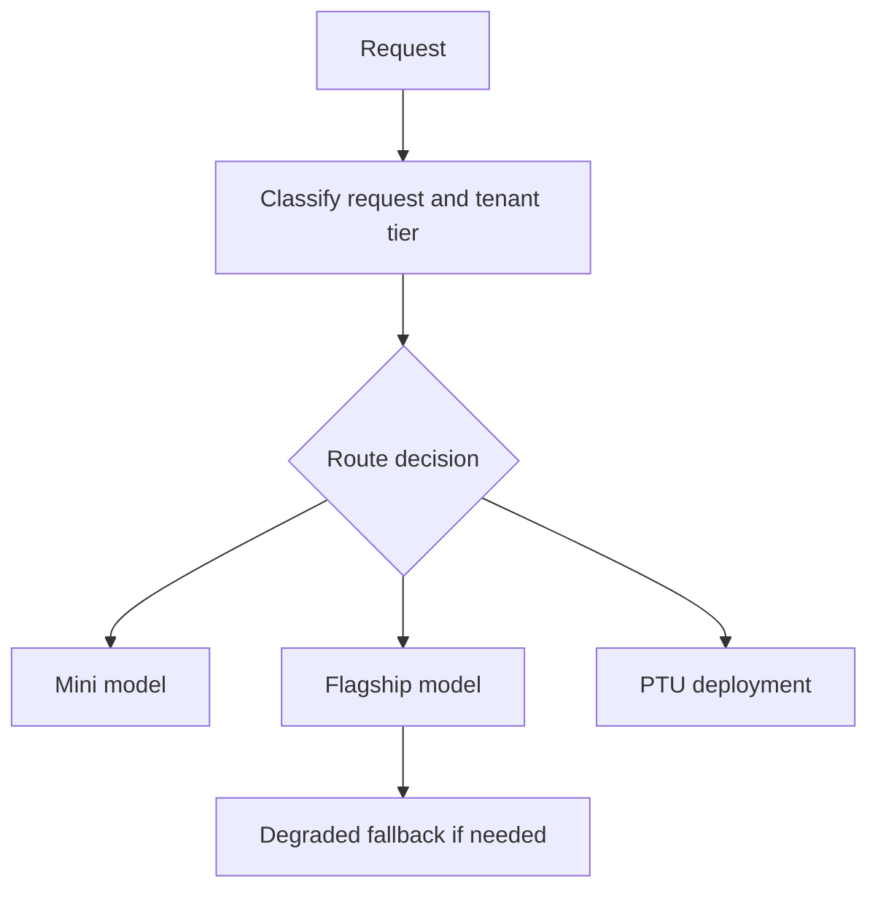

# Model Routing Flow

```mermaid
flowchart TD
  req[Request] --> classify[Classify request and tenant tier]
  classify --> route{Route decision}
  route --> mini[Mini model]
  route --> flagship[Flagship model]
  route --> ptu[PTU deployment]
  flagship --> degrade[Degraded fallback if needed]
```
