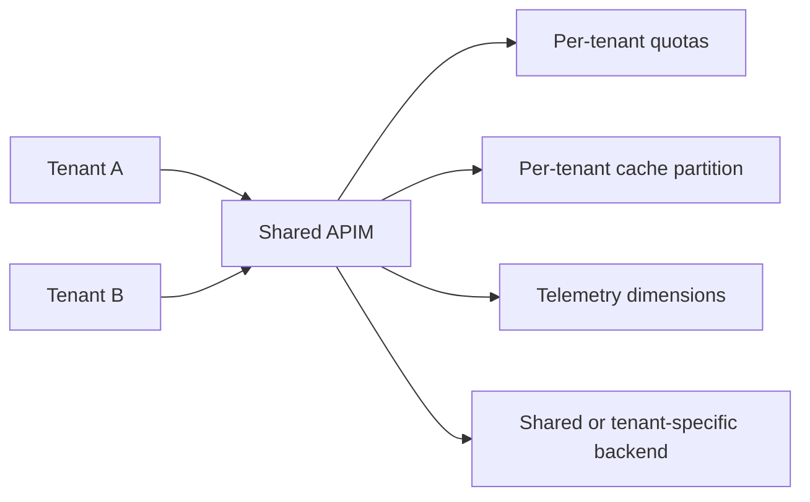

# Multitenant Isolation

```mermaid
flowchart LR
  t1[Tenant A] --> apim[Shared APIM]
  t2[Tenant B] --> apim
  apim --> quota[Per-tenant quotas]
  apim --> cache[Per-tenant cache partition]
  apim --> logs[Telemetry dimensions]
  apim --> backend[Shared or tenant-specific backend]
```
