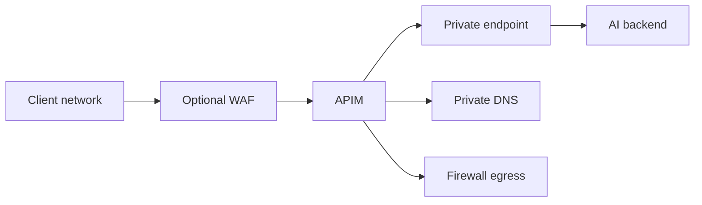

# Private Networking

```mermaid
flowchart LR
  client[Client network] --> waf[Optional WAF]
  waf --> apim[APIM]
  apim --> pe[Private endpoint]
  pe --> aoai[AI backend]
  apim --> dns[Private DNS]
  apim --> fw[Firewall egress]
```
