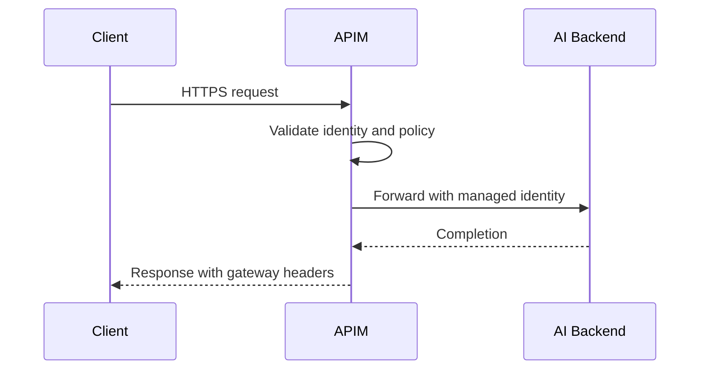

# Request Flow

```mermaid
sequenceDiagram
  participant C as Client
  participant A as APIM
  participant B as AI Backend
  C->>A: HTTPS request
  A->>A: Validate identity and policy
  A->>B: Forward with managed identity
  B-->>A: Completion
  A-->>C: Response with gateway headers
```
