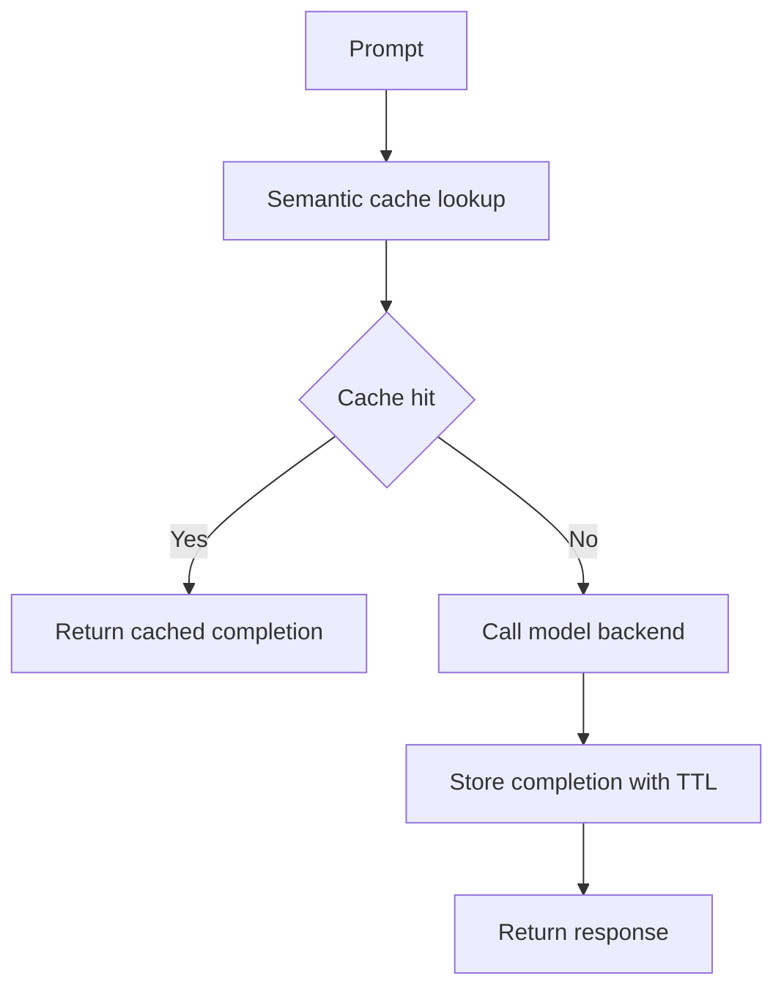

# Semantic Cache Flow

```mermaid
flowchart TD
  req[Prompt] --> lookup[Semantic cache lookup]
  lookup --> hit{Cache hit}
  hit -->|Yes| cached[Return cached completion]
  hit -->|No| backend[Call model backend]
  backend --> store[Store completion with TTL]
  store --> resp[Return response]
```
