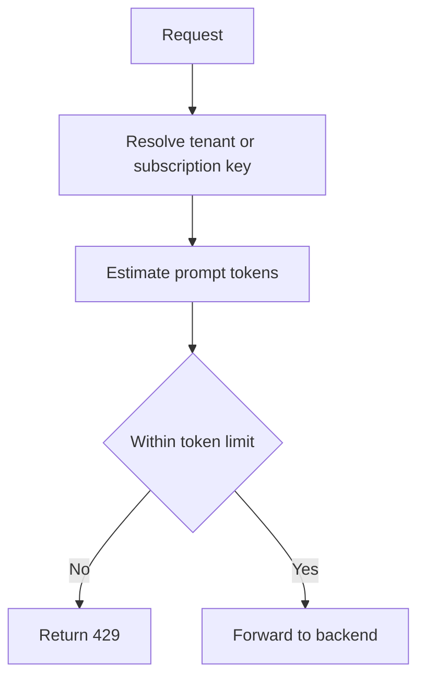

# Token Governance Flow

```mermaid
flowchart TD
  req[Request] --> key[Resolve tenant or subscription key]
  key --> estimate[Estimate prompt tokens]
  estimate --> limit{Within token limit}
  limit -->|No| reject[Return 429]
  limit -->|Yes| backend[Forward to backend]
```
