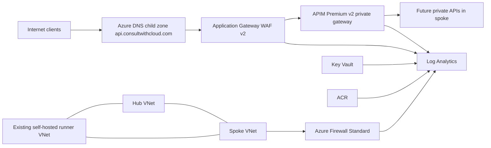

# Architecture: Hub-Spoke Network Foundation

## Purpose

This page explains the intended network shape for the hub-spoke APIM edge
platform. It is a scenario document, not a deployment runbook. The
implementation source of truth remains
`docs/plans/2026-05-27-hub-spoke-apim-edge-platform.md`,
`requirements/001-hub-spoke-apim-edge-platform.md`, and
`design-log/001-hub-spoke-apim-edge-platform.md`.

## Target shape

## Network boundaries

| Boundary    | Role                                                                               | Current scope                                      |
| ----------- | ---------------------------------------------------------------------------------- | -------------------------------------------------- |
| Hub VNet    | Shared ingress, egress, APIM, diagnostics, DNS, certificate, and registry services | Fully designed for the first deployable platform   |
| Spoke VNet  | Future workload network                                                            | Reserved subnets and egress routing only           |
| Runner VNet | Deployment and validation network                                                  | Existing network, directly peered to hub and spoke |

## Hub VNet

The hub is where shared platform controls live. In this lab it includes
Application Gateway WAF, APIM Premium v2, Azure Firewall, Log Analytics, Key
Vault, ACR, DNS records, managed identities, diagnostics, and peerings.

The hub subnets are:

| Subnet                   | CIDR           | Purpose                        |
| ------------------------ | -------------- | ------------------------------ |
| `AzureFirewallSubnet`    | `10.10.0.0/26` | Azure Firewall                 |
| `snet-appgw`             | `10.10.1.0/24` | Application Gateway WAF        |
| `snet-apim`              | `10.10.2.0/24` | APIM Premium v2 VNet injection |
| `snet-private-endpoints` | `10.10.3.0/24` | Reserved                       |

The hub is not a dumping ground for all future services. Shared platform
services belong here. Workload-specific services should move to a spoke unless
they are genuinely shared controls.

## Spoke VNet

The spoke exists to create a clean landing zone for future workloads. It
deliberately does not deploy AKS, private APIs, databases, or private endpoints
yet.

The spoke subnets are:

| Subnet                   | CIDR            | Purpose                             |
| ------------------------ | --------------- | ----------------------------------- |
| `snet-workload`          | `10.20.1.0/24`  | Future private APIs or app services |
| `snet-private-endpoints` | `10.20.2.0/24`  | Reserved private endpoint space     |
| `snet-aks`               | `10.20.10.0/23` | Future AKS                          |

The only committed spoke behavior in this scenario is outbound routing from
`snet-workload` and `snet-aks` to Azure Firewall. That preserves central egress
control without claiming the workload architecture is complete.

## Ingress path

1. Public clients resolve `api.consultwithcloud.com` in the Azure DNS child
   zone.
2. DNS points to Application Gateway public IP.
3. Application Gateway terminates TLS, applies WAF policy, and re-encrypts to
   APIM.
4. Application Gateway uses private DNS or equivalent records to reach the APIM
   gateway private IP.
5. APIM applies API gateway policies before forwarding to future private
   backends.

## Egress path

Future spoke workloads route internet-bound traffic to Azure Firewall. Azure
Firewall owns the outbound inspection point for the spoke. Application Gateway
and APIM are not forced through Azure Firewall with a default route in this pass
because their service behavior and control-plane requirements need a narrower
routing model.

## Peering model

VNet peerings are created in both directions for:

- Hub to spoke.
- Spoke to hub.
- Runner to hub.
- Hub to runner.
- Runner to spoke.
- Spoke to runner.

The runner gets direct peering to both hub and spoke because VNet peering does
not provide transitive connectivity by itself. Peering runner to hub only would
not make the spoke reachable through the hub.

## Sources

- [Microsoft Learn, Hub-spoke network topology in Azure][src-hub-spoke]
- [Microsoft Learn, Create or change VNet peering][src-peering]
- [Microsoft Learn, Inject Azure API Management Premium v2][src-apim-vnet]
- [Microsoft Learn, Application Gateway infrastructure][src-agw-infra]

[src-hub-spoke]:
  https://learn.microsoft.com/en-us/azure/architecture/networking/architecture/hub-spoke
[src-peering]:
  https://learn.microsoft.com/en-us/azure/virtual-network/virtual-network-manage-peering
[src-apim-vnet]:
  https://learn.microsoft.com/en-us/azure/api-management/inject-vnet-v2
[src-agw-infra]:
  https://learn.microsoft.com/en-us/azure/application-gateway/configuration-infrastructure
